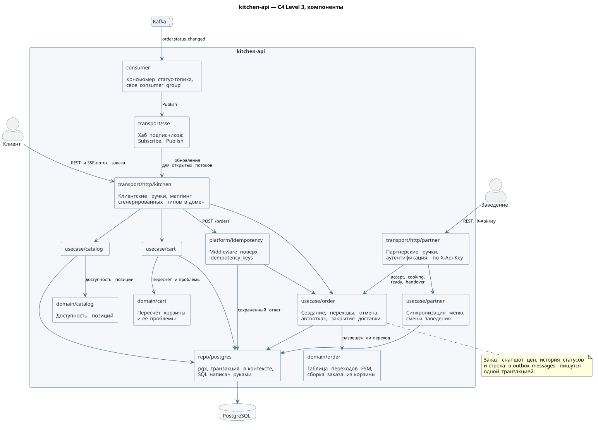
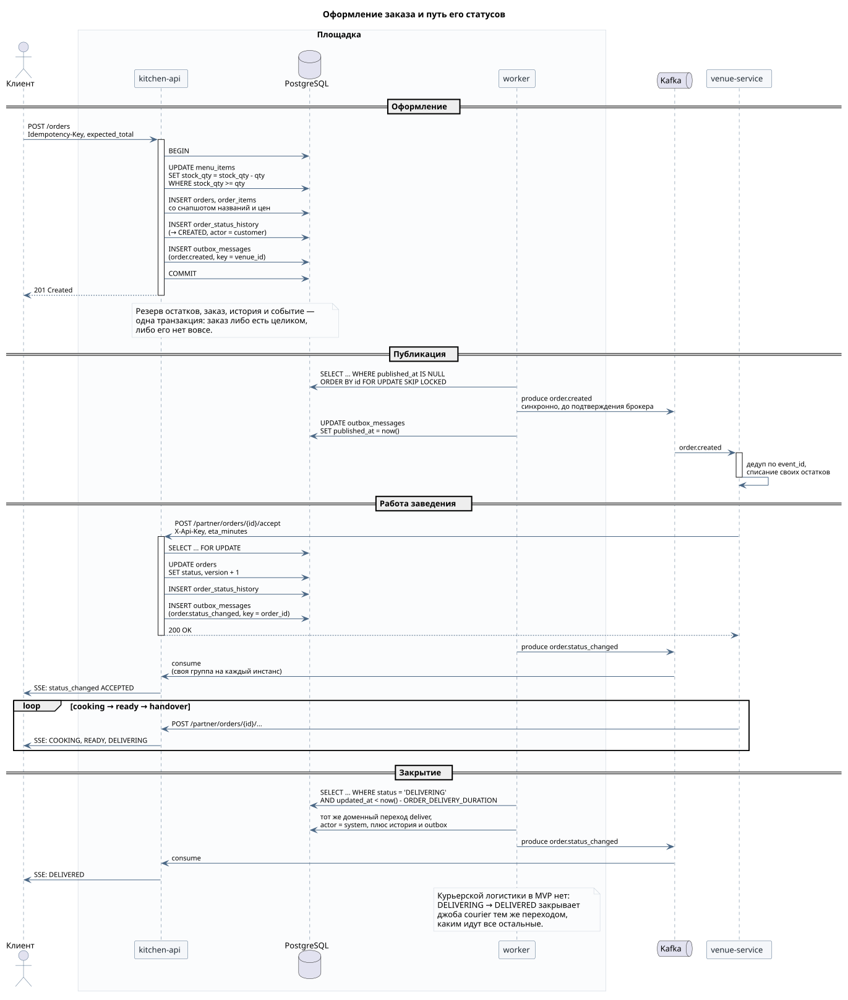
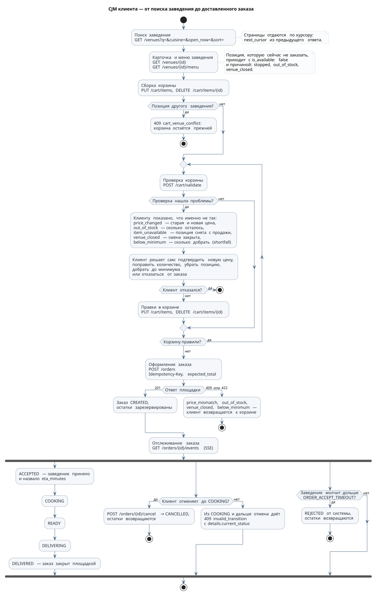
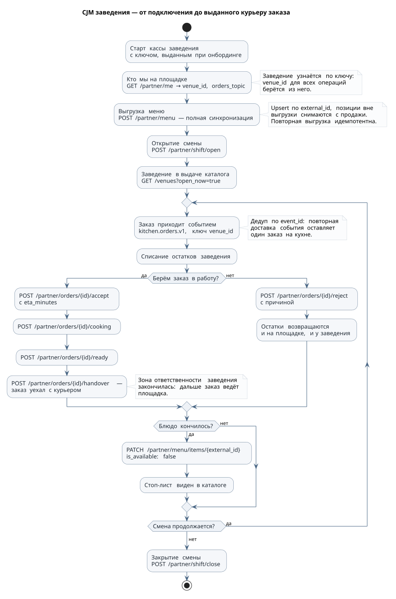
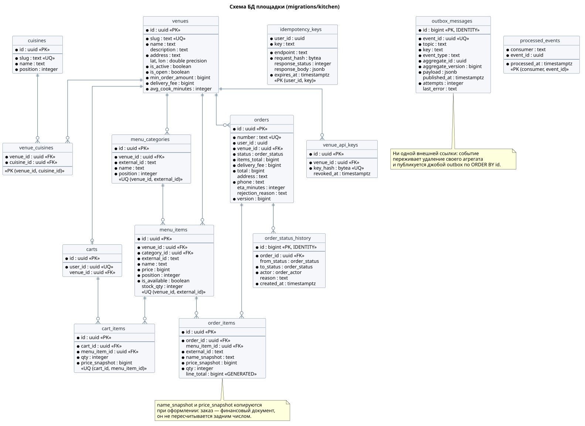

# Авито.Кухня

MVP бэкенда сервиса доставки еды. Площадка принимает заказы пользователей и
передаёт их в заведения; заведения сообщают площадке статусы заказа.

В репозитории две стороны интеграции:

- **площадка** — `cmd/`, `internal/`, `migrations/kitchen`: клиентский и
  партнёрский REST, SSE-поток статусов, outbox и фоновые джобы;
- **демо-заведение** — `venue/`: отдельный сервис со своей БД, который ходит на
  площадку ровно теми же путями, что доступны настоящему партнёру
  (сгенерированный клиент партнёрского API и Kafka). Подробности — [venue/README.md](venue/README.md).

## Быстрый старт

Нужен только Docker.

```bash
make up          # собрать и поднять приложения
make migrate-up  # применить схему площадки
make seed        # демо-заведения и API-ключи
```

Подготовка базы отделена от запуска приложений сознательно: «схема применена» и
«приложение работает» — разные события, поэтому `migrator` и `seeder` живут под
профилем `setup` и в `docker compose up` не попадают.

Проверка:

```bash
curl -s localhost:8081/healthz
curl -s "localhost:8081/api/v1/venues?open_now=true" | jq '.items[].name'
```

Пекарня «Батон» в выдаче появляется сама: `venue-service` при старте выгружает
своё меню через партнёрский API и открывает смену.

Дальше — сквозной сценарий:

```bash
make demo
```

`cmd/demo` проходит каталог, корзину, `validate`, оформление, слушает SSE-поток 
и проверяет **всю** последовательность статусов 
`ACCEPTED → COOKING → READY → DELIVERING → DELIVERED`, а заодно все
негативные сценарии: повтор `Idempotency-Key`, тот же ключ с другой корзиной,
изменение цены между проверкой и оформлением, заказ на кончившуюся позицию,
отмену из `COOKING` и автоотказ заказа, который заведение не приняло вовремя.

Проверку сценария «заведение лежит, заказ дойдёт, когда поднимется» демо делает по флагу, останавливая контейнер:

```bash
go run ./cmd/demo --outage
```

Порты демо: `8081` — API площадки, `8082` — `/healthz` демо-заведения,
`8080` — Redpanda Console (топики, лаг консьюмеров, содержимое сообщений),
`5432` и `5433` — базы площадки и заведения.

## Что умеет площадка

**Для пользователя-заказчика** (`api/openapi/kitchen.yaml`, заголовок `X-User-Id`):

| Ручка | Что делает |
|---|---|
| `GET /cuisines` | справочник кухонь |
| `GET /venues` | поиск по названию, фильтры по кухне и открытой смене, сортировка, курсорная пагинация |
| `GET /venues/{id}`, `GET /venues/{id}/menu` | карточка и меню; недоступные позиции показываются с причиной |
| `GET /cart`, `PUT /cart/items`, `DELETE /cart/items/{id}`, `DELETE /cart` | корзина; `qty: 0` удаляет позицию, позиция другого заведения — `409` |
| `POST /cart/validate` | дифф с текущим меню: `price_changed`, `out_of_stock`, `item_unavailable`, `venue_closed`, `below_minimum` со `shortfall` |
| `POST /orders` | оформление: `Idempotency-Key` + `expected_total` |
| `GET /orders`, `GET /orders/{id}` | список с курсором и карточка заказа |
| `POST /orders/{id}/cancel` | отмена — только до `COOKING` |
| `GET /orders/{id}/events` | SSE: снапшот заказа, статусы, heartbeat, реплей по `Last-Event-ID` |

**Для заведения** (`api/openapi/partner.yaml`, заголовок `X-Api-Key`):

| Ручка | Что делает |
|---|---|
| `GET /partner/me` | кто мы на площадке и в какой топик приходят заказы |
| `POST /partner/menu` | полная синхронизация меню, upsert по `external_id` |
| `PATCH /partner/menu/items/{external_id}` | стоп-лист, цена, остаток одной позиции |
| `POST /partner/shift/open` и `close` | открытие/закрытие смены |
| `POST /partner/orders/{id}/accept`, `reject`, `cooking`, `ready`, `handover` | переходы статусов |

На `handover` заказ уехал с курьером, дальше его ведёт площадка.

## Архитектура

| Контейнер | Что делает |
|---|---|
| `kitchen-api` | клиентский и партнёрский REST, SSE-поток статусов, консьюмер статус-топика |
| `worker` | фоновые джобы: `outbox`, `order-reaper`, `courier`, `idempotency-gc` |
| `postgres` | заведения, меню, корзины, заказы, история статусов, outbox, ключи идемпотентности |
| `redpanda` | `kitchen.orders.v1` (площадка → заведение), `kitchen.order-status.v1` (площадка → все, кто следит за заказом) |
| `venue-service` + `venue-postgres` | демо-заведение со своей базой |

### Ключевые решения

- **Слои: `transport → service → repo → db`.** Домен не знает ни про HTTP, ни
  про SQL; сгенерированные из спеки типы не проникают в домен — транспорт мапит
  их руками. SQL пишем через `pgx`.
- **Команда против события.** Заведение → площадка ходит REST-ом: нужен
  синхронный ответ и валидация («этот переход запрещён»). Площадка → заведение и
  площадка → клиент — Kafka: доставка не должна зависеть от того, жив ли
  получатель прямо сейчас. Ключ сообщения — `venue_id` для заказов и `order_id`
  для статусов, поэтому события одного заказа не переупорядочиваются.
- **Outbox.** Всякое доменное изменение, о котором должен узнать кто-то ещё,
  пишет строку в `outbox_messages` в той же транзакции. Прямых вызовов Kafka
  из хендлеров нет: заказ и событие о нём не могут разъехаться. Публикует джоба
  `outbox` — поллинг с адаптивным бэкоффом (0–250 мс), батч по `ORDER BY id`,
  синхронный продюсер, `published_at` — только после ack.
- **FSM заказа — данные.** Таблица
  `map[{fulfillment, from, event}]Status` в `internal/domain/order` — чистый Go
  без БД, покрытый юнит-тестами на все разрешённые и все запрещённые переходы.
  Применение перехода — под `SELECT ... FOR UPDATE` с инкрементом `version`.
  Повтор уже применённого события даёт `200` и не пишет ничего — ни истории, ни
  outbox.
- **Снапшот цен в заказе.** `order_items` хранит `name_snapshot` и
  `price_snapshot`: заказ — финансовый документ, он не пересчитывается задним
  числом, даже если заведение поменяло меню.
- **Идемпотентность — отдельная таблица `idempotency_keys`**
  middleware поверх неё сравнивает отпечаток распарсенного тела и
  отдаёт сохранённый ответ на повтор, `422 idempotency_key_reuse` — на тот же
  ключ с другим телом. Переходы FSM идемпотентны по конструкции, ключ им не
  нужен.



### Жизнь заказа



```
CREATED ─accept→ ACCEPTED ─start→ COOKING ─ready→ READY ─handover→ DELIVERING ─deliver→ DELIVERED
   │                 │
   ├─reject→ REJECTED    (возврат остатков)
   └─cancel→ CANCELLED   (только из CREATED/ACCEPTED, возврат остатков)
```

Два перехода делает не человек, и ещё одна джоба убирает за ними:

- **`order-reaper`** отклоняет заказ, который заведение не приняло за
  `ORDER_ACCEPT_TIMEOUT` (в демо 30 с), — тем же доменным переходом, что и
  ручное отклонение, с `actor = system` и возвратом остатков;
- **`courier`** закрывает заказ, уехавший дольше `ORDER_DELIVERY_DURATION` назад
  (в демо 5 с): курьерской логистики в MVP нет, а статус обязан доходить до
  конца;
- **`idempotency-gc`** подчищает истёкшие ключи.

### Путь клиента и путь заведения





### События

Схемы — `api/asyncapi/events.yaml`. Конверт у всех один: `event_id`,
`event_type`, `occurred_at`, `aggregate_id`, `version`, `payload`.

| Топик | События | Ключ | Кто читает |
|---|---|---|---|
| `kitchen.orders.v1` | `order.created`, `order.cancelled` | `venue_id` | заведения |
| `kitchen.order-status.v1` | `order.status_changed` | `order_id` | `kitchen-api` для SSE; сюда же подключаются будущие потребители — push, поиск курьера, аналитика |

Консьюмеры дедуплицируют события по `event_id` (`processed_events`): доставка
at-least-once, отметка ставится в транзакции с работой, которую событие вызвало.

## Схема БД

Миграции — `migrations/kitchen`, применяются образом `migrate/migrate`; все
`down`-миграции написаны и обратимы. Демо-данных в миграциях нет, только
справочник `cuisines`.



| Таблица | Описание |
|---|---|
| `venues` | заведения: адрес, координаты, минимальная сумма, стоимость доставки, открыта ли смена |
| `cuisines`, `venue_cuisines` | справочник кухонь и связь M:N — нормализовано: нужна ссылочная целостность и справочник для фильтров |
| `venue_api_keys` | `sha256(key)`, сравнение — `subtle.ConstantTimeCompare`; сам ключ в БД не хранится |
| `menu_categories`, `menu_items` | `UNIQUE (venue_id, external_id)` — интеграция идёт по внутренним идентификаторам системы заведения; `stock_qty IS NULL` — остаток не ограничен |
| `carts`, `cart_items` | одна корзина на пользователя, `price_snapshot` — цена, которую он видел, с ней сравнивает `validate` |
| `orders`, `order_items` | `line_total` — `GENERATED ALWAYS`; `address` nullable (задел под самовывоз, обязательность проверяет валидация); `version` растёт на каждом переходе |
| `order_status_history` | кто и когда двигал заказ: `actor` — `customer`, `venue` или `system`; `id` этой записи и есть `Last-Event-ID` в SSE |
| `idempotency_keys` | `PRIMARY KEY (user_id, key)`, отпечаток тела и сохранённый ответ, `expires_at` для сборки мусора |
| `outbox_messages` | события, ждущие публикации; частичный индекс `(id) WHERE published_at IS NULL` — батч забирается в порядке `id` |
| `processed_events` | дедуп входящих событий по `(consumer, event_id)` |

## Ошибки

Один конверт на все ручки:

```json
{
  "code": "invalid_transition",
  "message": "order is in COOKING",
  "details": {"current_status": "COOKING"},
  "trace_id": "01J..."
}
```

`trace_id` тот же, что в структурных логах сервиса (`log/slog`, JSON), — по нему
запрос находится целиком. Внутри — доменные sentinel-ошибки
(`domain.ErrNotFound`, `domain.ErrInvalidTransition`), в HTTP-коды они
превращаются только в транспорте.

## Тесты

```bash
make test          # unit + интеграционный на testcontainers
go test -short ./...   # без Docker: интеграционный пропускается
make lint
```

Три уровня, каждый на своём материале:

| Уровень | Что покрывает | Чем |
|---|---|---|
| Unit | FSM заказа, пересчёт и проблемы корзины, доступность позиций, курсоры, конверт событий | таблицы случаев, без моков — домен ни от чего не зависит |
| Юзкейс | ветвления сценариев: нет остатка, чужой заказ, закрытая смена, повторный ключ | моки, сгенерированные `mockery` |
| Интеграционный | сквозной путь заказа | `internal/integration`: Postgres и Redpanda в testcontainers, HTTP-роутер, джобы и консьюмер статусов в процессе теста |

Интеграционный тест поднимает те же образы, что и compose, накатывает те же
миграции и проверяет полный круг: каталог → корзина → заказ → событие в
`kitchen.orders.v1` → партнёрские переходы → статусы в SSE → `DELIVERED` от
джобы `courier` → пустой outbox.

## Команды

| Команда | Что делает |
|---|---|
| `make up` | собрать и поднять приложения |
| `make migrate-up` | применить миграции площадки (`migrate-down`, `migrate-down-all`, `migrate-create name=...`, `migrate-version` — рядом) |
| `make seed` | демо-заведения и API-ключи, идемпотентно |
| `make down` / `make clean` | остановить; `clean` ещё и стирает тома |
| `make test` / `make lint` | тесты и линтеры |
| `make generate` / `make mocks` | кодоген по спекам и моки |
| `make demo` | сквозной сценарий против живого стенда |
| `make diagrams` | отрисовать `docs/*.puml` в SVG (образ `plantuml/plantuml`) |

Для работы `make lint` необходим установленный `golangci-ling`.

Переменные окружения со значениями по умолчанию — в
[`.env.example`](.env.example). Для демо файл необязателен: значения задаёт
compose.

## Структура репозитория

```
cmd/                 точки входа площадки: kitchen-api, worker, seed, demo
internal/
  api/               кодоген по спекам: модели, серверы, клиенты
  domain/            FSM заказа, корзина, доступность — чистый Go
  usecase/           сценарии поверх узких интерфейсов репозиториев
  repo/postgres/     реализации репозиториев на pgx
  transport/http/    хендлеры, маппинг кодогена в домен, единый конверт ошибок
  transport/sse/     хаб подписчиков
  broker/kafka/      продюсер, консьюмер, конверт события, inbox-дедуп
  worker/            фоновые джобы
  integration/       сквозной тест на testcontainers
venue/               демо-заведение целиком: свой cmd, свои миграции, своя БД
api/openapi/         kitchen.yaml, partner.yaml
api/asyncapi/        events.yaml
migrations/kitchen/  схема площадки
docs/                диаграммы в PlantUML и их рендер
```

## Допущения

Часть решений сознательно упрощена:

- **Нет авторизации клиента** — заголовок `X-User-Id` как заглушка.
  Заказы привязаны к нему в БД, поэтому замена способа аутентификации на JWT или
  шлюз не затрагивает ни схему, ни логику.
- **Нет оплаты**: заказ считается оплаченным при создании.
- **Курьерская логистика заглушена**: `DELIVERING → DELIVERED` ставит джоба
  `courier` по таймеру. Партнёрской ручки `deliver` нет — на `handover`
  заведение отдало заказ и больше за него не отвечает.
- **Геопоиск упрощён** до фильтра по тегам и городу, без гео-индекса.
- **Меню без модификаторов** и опций блюд.
- **Нет rate-limiting, кэша, распределённого трейсинга**; из наблюдаемости —
  структурные логи, `trace_id` и `/healthz`.
- **Один инстанс `kitchen-api` и один `worker`.** Код к масштабированию готов:
  хаб SSE не держит общего состояния, статусы ходят через Kafka.

## Точки расширения

Спроектированы заранее, каждая стоит немного:

- **Самовывоз.** `fulfillment_type` на заказе и ветка
  `READY --pickup--> PICKED_UP` — две строки в таблице переходов и одна
  миграция: FSM задан данными, а `address` уже nullable.
- **Новые потребители статусов** — push и SMS, поиск курьера на `READY`,
  аналитика времени готовки, SLA-монитор. Каждый — своя consumer group на
  `kitchen.order-status.v1`, ноль правок в коде оформления заказа.
- **Курьерский сервис** вместо джобы `courier`: `deliver` уже отдельное событие
  FSM и применяется тем же кодом, что и остальные переходы. Из правок — `courier`
  в enum `order_actor` и `courier_id` на заказе.
- **Второй экземпляр `worker`.** Джобы уже берут строки `FOR UPDATE SKIP
  LOCKED`, лидер им не нужен. Мешает только порядок публикации: два события
  одного заказа могут попасть в батчи разных воркеров. Лечится шардированием
  выборки — `WHERE hashtext(aggregate_id::text) % $N = $I`.
- **Партнёры без Kafka** — опрос `GET /partner/orders?since=` уже в спеке;
  вебхуки и полностью ручной режим описаны в §7.5 PLAN.md.
- **Масштабирование**: более гранулярный ключ партиции для крупной сети,
  вынос каталога с полнотекстовым поиском в отдельный сервис.

## Использование ИИ

Код написан с помощью Claude Code поэтапно по плану — [PLAN.md](PLAN.md).
